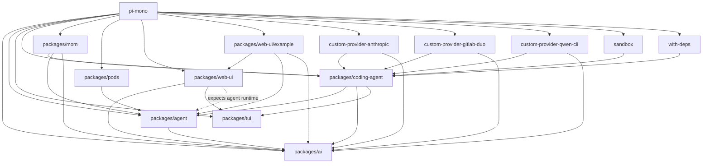
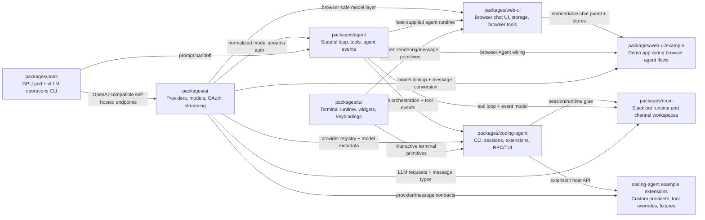

# Pi Monorepo AI Context

Updated: 2026-03-31T14:43:29+08:00

## Vision
Pi Monorepo is a TypeScript workspace for building agentic products across terminal, browser, Slack, and self-hosted inference environments. Its base layers normalize model/provider access in `packages/ai`, orchestrate multi-turn tool-using agents in `packages/agent`, and provide terminal and web presentation primitives in `packages/tui` and `packages/web-ui`. On top of that foundation, the repo ships end-user products such as the `pi` coding agent, the Slack-based `mom` bot, the `pi` pods CLI, and a set of extension/example workspaces that demonstrate customization outside core packages.

## Workspace Map



## Architecture Overview



## Module Index
| Module | Purpose | Local context |
| --- | --- | --- |
| `packages/ai` | Base LLM integration layer for provider registration, models, OAuth, and normalized streaming. | [`packages/ai/AGENTS.md`](packages/ai/AGENTS.md) |
| `packages/agent` | Stateful agent runtime that owns conversation state, loop execution, tool orchestration, and agent events. | [`packages/agent/AGENTS.md`](packages/agent/AGENTS.md) |
| `packages/coding-agent` | Main `pi` product package covering CLI, SDK, sessions, tools, modes, extensions, and interactive TUI flows. | [`packages/coding-agent/AGENTS.md`](packages/coding-agent/AGENTS.md) |
| `packages/coding-agent/examples/extensions/custom-provider-anthropic` | Example extension that registers a custom Anthropic-backed provider with env-key and OAuth support. | [`packages/coding-agent/examples/extensions/custom-provider-anthropic/AGENTS.md`](packages/coding-agent/examples/extensions/custom-provider-anthropic/AGENTS.md) |
| `packages/coding-agent/examples/extensions/custom-provider-gitlab-duo` | Example extension exposing GitLab Duo models through Pi by combining OAuth/token handling with existing Anthropic/OpenAI adapters. | [`packages/coding-agent/examples/extensions/custom-provider-gitlab-duo/AGENTS.md`](packages/coding-agent/examples/extensions/custom-provider-gitlab-duo/AGENTS.md) |
| `packages/coding-agent/examples/extensions/custom-provider-qwen-cli` | Minimal OAuth-backed custom provider example for Qwen CLI and DashScope-compatible model access. | [`packages/coding-agent/examples/extensions/custom-provider-qwen-cli/AGENTS.md`](packages/coding-agent/examples/extensions/custom-provider-qwen-cli/AGENTS.md) |
| `packages/coding-agent/examples/extensions/sandbox` | Example extension that overrides `bash` with an OS-level sandbox and adds related flags, commands, and lifecycle hooks. | [`packages/coding-agent/examples/extensions/sandbox/AGENTS.md`](packages/coding-agent/examples/extensions/sandbox/AGENTS.md) |
| `packages/coding-agent/examples/extensions/with-deps` | Fixture extension proving Pi can load extension-local npm dependencies from a separate workspace package. | [`packages/coding-agent/examples/extensions/with-deps/AGENTS.md`](packages/coding-agent/examples/extensions/with-deps/AGENTS.md) |
| `packages/mom` | Slack bot harness that runs the coding agent against per-channel workspaces, history, attachments, and scheduled events. | [`packages/mom/AGENTS.md`](packages/mom/AGENTS.md) |
| `packages/pods` | CLI for provisioning GPU pods, installing vLLM, and managing self-hosted model processes/endpoints. | [`packages/pods/AGENTS.md`](packages/pods/AGENTS.md) |
| `packages/tui` | Terminal UI framework providing differential rendering, terminal I/O, widgets, and configurable keybindings. | [`packages/tui/AGENTS.md`](packages/tui/AGENTS.md) |
| `packages/web-ui` | Browser UI package with chat components, dialogs, browser-safe tools, artifact rendering, and IndexedDB-backed storage. | [`packages/web-ui/AGENTS.md`](packages/web-ui/AGENTS.md) |
| `packages/web-ui/example` | Vite demo app showing how to embed `@mariozechner/pi-web-ui` with browser agent state, storage, and custom messages. | [`packages/web-ui/example/AGENTS.md`](packages/web-ui/example/AGENTS.md) |

## Global Standards
- Use the repo root as the operating context: `package.json` defines npm workspaces for all first-class packages plus selected example workspaces, and contributors are expected to run tools/agents from the monorepo root.
- Keep package boundaries intact. `packages/ai` is the provider/model foundation, `packages/agent` owns orchestration, `packages/tui` and `packages/web-ui` provide UI primitives, product packages consume those layers, and example extensions are the preferred place for custom integrations that do not belong in core.
- The workspace is TypeScript + ESM with a Node `>=20` floor, root `strict` compiler settings, and path aliases that point package imports at source during local development.
- `npm run check` is the shared quality gate: it runs Biome with `--write --error-on-warnings`, `tsgo --noEmit`, a browser smoke check, and the `packages/web-ui` check. Husky pre-commit runs the same gate and re-stages files that formatting changed.
- Biome is the canonical formatter/linter. Repo defaults are tabs, `indentWidth: 3`, `lineWidth: 120`, recommended lint rules, and selective exclusions for generated files, build outputs, fixture data, and `node_modules`.
- Prefer strongly typed public entry points, package-local tests, and documented extension/provider registration surfaces over deep private imports or implicit cross-package coupling. Several example modules intentionally exist to show how to extend Pi without patching core packages.
- Do not hand-edit generated artifacts or inferred registries when a generator/script is the source of truth. Align public behavior changes with the relevant package README, changelog, and local `AGENTS.md` before editing.
- CONTRIBUTING establishes an extension-first, understanding-first culture: keep the core minimal, avoid speculative bloat, and make sure changes are explainable end to end.

## Scan Status
- Strategy used: listed the repo root, read the workspace/root manifest and config files, read every requested module `AGENTS.md` in full, then skimmed additional root policy/config files for repo-wide standards.
- Estimated tracked files: `765` via `git ls-files`; direct reads in this pass: `22` files total (`13` module `AGENTS.md` files and `9` root docs/config files), plus directory listings/searches.
- Coverage: full local-context coverage for `13/13` requested modules; shallow root-policy coverage only; module source files were intentionally not re-read per the scan instructions.
- Root files skimmed for standards: `package.json`, `tsconfig.json`, `tsconfig.base.json`, `biome.json`, `CONTRIBUTING.md`, `README.md`, `.husky/pre-commit`, `.gitignore`, and the existing root `AGENTS.md`.
- Recommended next deep dives if implementation work follows: `packages/agent/src/agent-loop.ts`, `packages/ai/src/providers/`, `packages/coding-agent/src/main.ts`, `packages/coding-agent/src/core/agent-session.ts`, `packages/mom/src/slack.ts`, `packages/pods/src/commands/`, `packages/tui/src/tui.ts`, `packages/web-ui/src/ChatPanel.ts`, `packages/web-ui/example/src/main.ts`, and `packages/coding-agent/examples/extensions/*/index.ts`.
- Re-run guidance: refresh this root index from module `AGENTS.md` files first, then only rescan root config when workspace structure, tooling, or repo-wide policy changes.

---

# Development Rules

## First Message
If the user did not give you a concrete task in their first message,
read README.md, then ask which module(s) to work on. Based on the answer, read the relevant README.md files in parallel.
- packages/ai/README.md
- packages/tui/README.md
- packages/agent/README.md
- packages/coding-agent/README.md
- packages/mom/README.md
- packages/pods/README.md
- packages/web-ui/README.md

## Code Quality
- No `any` types unless absolutely necessary
- Check node_modules for external API type definitions instead of guessing
- **NEVER use inline imports** - no `await import("./foo.js")`, no `import("pkg").Type` in type positions, no dynamic imports for types. Always use standard top-level imports.
- NEVER remove or downgrade code to fix type errors from outdated dependencies; upgrade the dependency instead
- Always ask before removing functionality or code that appears to be intentional
- Do not preserve backward compatibility unless the user explicitly asks for it
- Never hardcode key checks with, eg. `matchesKey(keyData, "ctrl+x")`. All keybindings must be configurable. Add default to matching object (`DEFAULT_EDITOR_KEYBINDINGS` or `DEFAULT_APP_KEYBINDINGS`)

## Commands
- After code changes (not documentation changes): `npm run check` (get full output, no tail). Fix all errors, warnings, and infos before committing.
- Note: `npm run check` does not run tests.
- NEVER run: `npm run dev`, `npm run build`, `npm test`
- Only run specific tests if user instructs: `npx tsx ../../node_modules/vitest/dist/cli.js --run test/specific.test.ts`
- Run tests from the package root, not the repo root.
- If you create or modify a test file, you MUST run that test file and iterate until it passes.
- When writing tests, run them, identify issues in either the test or implementation, and iterate until fixed.
- For `packages/coding-agent/test/suite/`, use `test/suite/harness.ts` plus the faux provider. Do not use real provider APIs, real API keys, or paid tokens.
- Put issue-specific regressions under `packages/coding-agent/test/suite/regressions/` and name them `<issue-number>-<short-slug>.test.ts`.
- NEVER commit unless user asks

## GitHub Issues
When reading issues:
- Always read all comments on the issue
- Use this command to get everything in one call:
  ```bash
  gh issue view <number> --json title,body,comments,labels,state
  ```

## OSS Weekend
- If the user says `enable OSS weekend mode until X`, run `node scripts/oss-weekend.mjs --mode=close --end-date=YYYY-MM-DD --git` with the requested end date
- If the user says `end OSS weekend mode`, run `node scripts/oss-weekend.mjs --mode=open --git`
- The script updates `README.md`, `packages/coding-agent/README.md`, and `.github/oss-weekend.json`
- With `--git`, the script stages only those OSS weekend files, commits them, and pushes them
- During OSS weekend, `.github/workflows/oss-weekend-issues.yml` auto-closes new issues from non-maintainers, and `.github/workflows/pr-gate.yml` auto-closes PRs from approved non-maintainers with the weekend message

When creating issues:
- Add `pkg:*` labels to indicate which package(s) the issue affects
  - Available labels: `pkg:agent`, `pkg:ai`, `pkg:coding-agent`, `pkg:mom`, `pkg:pods`, `pkg:tui`, `pkg:web-ui`
- If an issue spans multiple packages, add all relevant labels

When posting issue/PR comments:
- Write the full comment to a temp file and use `gh issue comment --body-file` or `gh pr comment --body-file`
- Never pass multi-line markdown directly via `--body` in shell commands
- Preview the exact comment text before posting
- Post exactly one final comment unless the user explicitly asks for multiple comments
- If a comment is malformed, delete it immediately, then post one corrected comment
- Keep comments concise, technical, and in the user's tone

When closing issues via commit:
- Include `fixes #<number>` or `closes #<number>` in the commit message
- This automatically closes the issue when the commit is merged

## PR Workflow
- Analyze PRs without pulling locally first
- If the user approves: create a feature branch, pull PR, rebase on main, apply adjustments, commit, merge into main, push, close PR, and leave a comment in the user's tone
- You never open PRs yourself. We work in feature branches until everything is according to the user's requirements, then merge into main, and push.

## Tools
- GitHub CLI for issues/PRs
- Add package labels to issues/PRs: pkg:agent, pkg:ai, pkg:coding-agent, pkg:mom, pkg:pods, pkg:tui, pkg:web-ui

## Testing pi Interactive Mode with tmux

To test pi's TUI in a controlled terminal environment:

```bash
# Create tmux session with specific dimensions
tmux new-session -d -s pi-test -x 80 -y 24

# Start pi from source
tmux send-keys -t pi-test "cd /Users/badlogic/workspaces/pi-mono && ./pi-test.sh" Enter

# Wait for startup, then capture output
sleep 3 && tmux capture-pane -t pi-test -p

# Send input
tmux send-keys -t pi-test "your prompt here" Enter

# Send special keys
tmux send-keys -t pi-test Escape
tmux send-keys -t pi-test C-o  # ctrl+o

# Cleanup
tmux kill-session -t pi-test
```

## Style
- Keep answers short and concise
- No emojis in commits, issues, PR comments, or code
- No fluff or cheerful filler text
- Technical prose only, be kind but direct (e.g., "Thanks @user" not "Thanks so much @user!")

## Changelog
Location: `packages/*/CHANGELOG.md` (each package has its own)

### Format
Use these sections under `## [Unreleased]`:
- `### Breaking Changes` - API changes requiring migration
- `### Added` - New features
- `### Changed` - Changes to existing functionality
- `### Fixed` - Bug fixes
- `### Removed` - Removed features

### Rules
- Before adding entries, read the full `[Unreleased]` section to see which subsections already exist
- New entries ALWAYS go under `## [Unreleased]` section
- Append to existing subsections (e.g., `### Fixed`), do not create duplicates
- NEVER modify already-released version sections (e.g., `## [0.12.2]`)
- Each version section is immutable once released

### Attribution
- **Internal changes (from issues)**: `Fixed foo bar ([#123](https://github.com/badlogic/pi-mono/issues/123))`
- **External contributions**: `Added feature X ([#456](https://github.com/badlogic/pi-mono/pull/456) by [@username](https://github.com/username))`

## Adding a New LLM Provider (packages/ai)

Adding a new provider requires changes across multiple files:

### 1. Core Types (`packages/ai/src/types.ts`)
- Add API identifier to `Api` type union (e.g., `"bedrock-converse-stream"`)
- Create options interface extending `StreamOptions`
- Add mapping to `ApiOptionsMap`
- Add provider name to `KnownProvider` type union

### 2. Provider Implementation (`packages/ai/src/providers/`)
Create provider file exporting:
- `stream<Provider>()` function returning `AssistantMessageEventStream`
- `streamSimple<Provider>()` for `SimpleStreamOptions` mapping
- Provider-specific options interface
- Message/tool conversion functions
- Response parsing emitting standardized events (`text`, `tool_call`, `thinking`, `usage`, `stop`)

### 3. Provider Exports and Lazy Registration
- Add a package subpath export in `packages/ai/package.json` pointing at `./dist/providers/<provider>.js`
- Add `export type` re-exports in `packages/ai/src/index.ts` for provider option types that should remain available from the root entry
- Register the provider in `packages/ai/src/providers/register-builtins.ts` via lazy loader wrappers, do not statically import provider implementation modules there
- Add credential detection in `packages/ai/src/env-api-keys.ts`

### 4. Model Generation (`packages/ai/scripts/generate-models.ts`)
- Add logic to fetch/parse models from provider source
- Map to standardized `Model` interface

### 5. Tests (`packages/ai/test/`)
Add provider to: `stream.test.ts`, `tokens.test.ts`, `abort.test.ts`, `empty.test.ts`, `context-overflow.test.ts`, `image-limits.test.ts`, `unicode-surrogate.test.ts`, `tool-call-without-result.test.ts`, `image-tool-result.test.ts`, `total-tokens.test.ts`, `cross-provider-handoff.test.ts`.

For `cross-provider-handoff.test.ts`, add at least one provider/model pair. If the provider exposes multiple model families (for example GPT and Claude), add at least one pair per family.

For non-standard auth, create utility (e.g., `bedrock-utils.ts`) with credential detection.

### 6. Coding Agent (`packages/coding-agent/`)
- `src/core/model-resolver.ts`: Add default model ID to `DEFAULT_MODELS`
- `src/cli/args.ts`: Add env var documentation
- `README.md`: Add provider setup instructions

### 7. Documentation
- `packages/ai/README.md`: Add to providers table, document options/auth, add env vars
- `packages/ai/CHANGELOG.md`: Add entry under `## [Unreleased]`

## Releasing

**Lockstep versioning**: All packages always share the same version number. Every release updates all packages together.

**Version semantics** (no major releases):
- `patch`: Bug fixes and new features
- `minor`: API breaking changes

### Steps

1. **Update CHANGELOGs**: Ensure all changes since last release are documented in the `[Unreleased]` section of each affected package's CHANGELOG.md

2. **Run release script**:
   ```bash
   npm run release:patch    # Fixes and additions
   npm run release:minor    # API breaking changes
   ```

The script handles: version bump, CHANGELOG finalization, commit, tag, publish, and adding new `[Unreleased]` sections.

## **CRITICAL** Tool Usage Rules **CRITICAL**
- NEVER use sed/cat to read a file or a range of a file. Always use the read tool (use offset + limit for ranged reads).
- You MUST read every file you modify in full before editing.

## **CRITICAL** Git Rules for Parallel Agents **CRITICAL**

Multiple agents may work on different files in the same worktree simultaneously. You MUST follow these rules:

### Committing
- **ONLY commit files YOU changed in THIS session**
- ALWAYS include `fixes #<number>` or `closes #<number>` in the commit message when there is a related issue or PR
- NEVER use `git add -A` or `git add .` - these sweep up changes from other agents
- ALWAYS use `git add <specific-file-paths>` listing only files you modified
- Before committing, run `git status` and verify you are only staging YOUR files
- Track which files you created/modified/deleted during the session

### Forbidden Git Operations
These commands can destroy other agents' work:
- `git reset --hard` - destroys uncommitted changes
- `git checkout .` - destroys uncommitted changes
- `git clean -fd` - deletes untracked files
- `git stash` - stashes ALL changes including other agents' work
- `git add -A` / `git add .` - stages other agents' uncommitted work
- `git commit --no-verify` - bypasses required checks and is never allowed

### Safe Workflow
```bash
# 1. Check status first
git status

# 2. Add ONLY your specific files
git add packages/ai/src/providers/transform-messages.ts
git add packages/ai/CHANGELOG.md

# 3. Commit
git commit -m "fix(ai): description"

# 4. Push (pull --rebase if needed, but NEVER reset/checkout)
git pull --rebase && git push
```

### If Rebase Conflicts Occur
- Resolve conflicts in YOUR files only
- If conflict is in a file you didn't modify, abort and ask the user
- NEVER force push

### User override
If the user instructions conflict with rules set out here, ask for confirmation that they want to override the rules. Only then execute their instructions.
